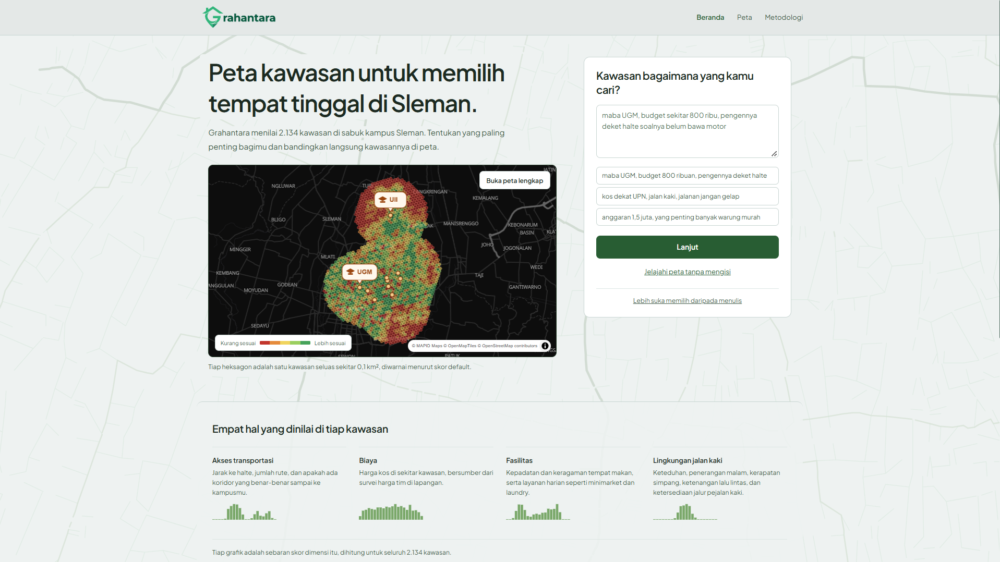
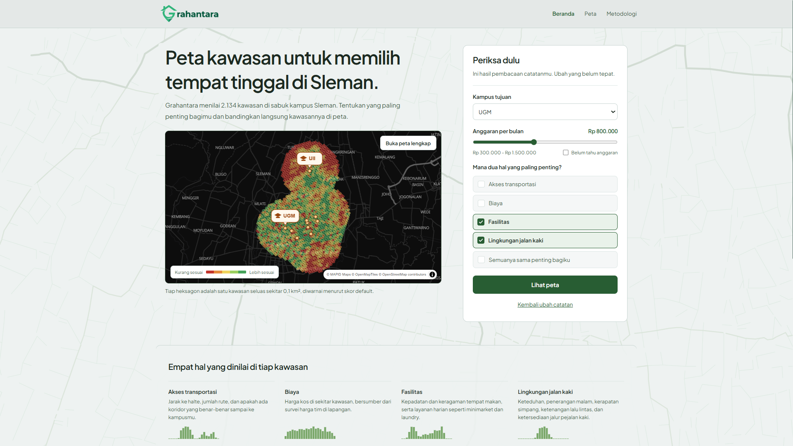
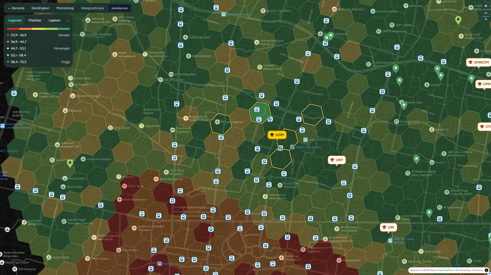
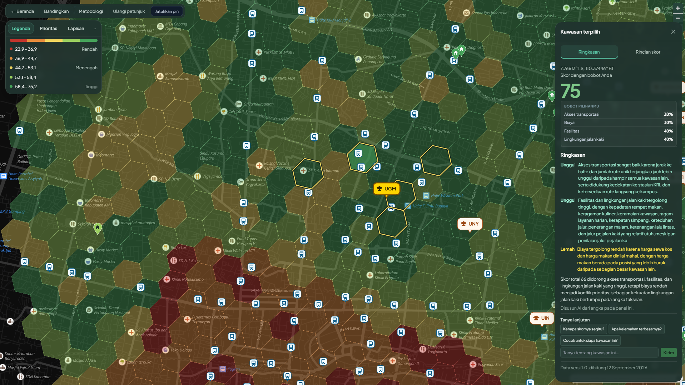
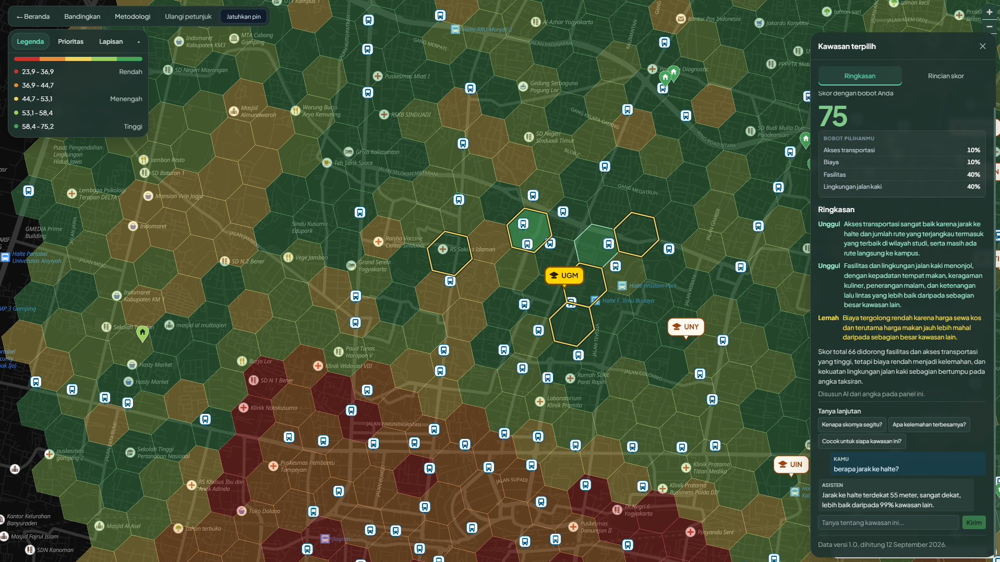
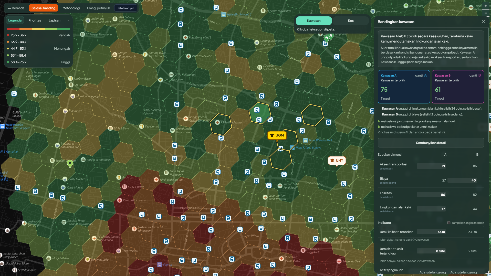
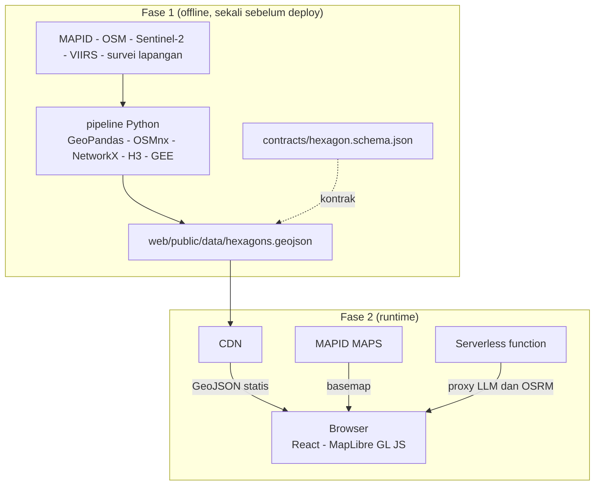

<div align="center">

<a href="https://grahantara.space">
  
</a>

[](https://grahantara.space)
[](https://mapid.co.id)


 
<br>

**Memilih tempat tinggal itu keputusan mobilitas.**

</div>

Grahantara menilai kelayakan kawasan hunian untuk mahasiswa di sabuk kampus
Sleman, DIY dari segi akses mobilitas tanpa kendaraan pribadi, biaya hidup,
fasilitas sekitar, dan kenyamanan berjalan kaki.


<sub>
Dibuat oleh tim <code>cinajawabatak</code> untuk MAPID WebGIS Competition 2026, tema <i>Maps That Think! Mass Transportation Edition</i>.
</sub>

---

## Daftar Isi

- [Yang kami buat](#yang-kami-buat)
- [Cara pakai](#cara-pakai)
- [AI-nya ngapain saja](#ai-nya-ngapain-saja)
- [Arsitektur](#arsitektur)
- [Isi repo](#isi-repo)
- [Menjalankan](#menjalankan)
- [Data MAPID](#data-mapid)
- [Tim](#tim)

---

## Yang kami buat

Wilayah studi dipecah jadi **2.134 heksagon H3 resolusi 9**. Tiap heksagon
dinilai pakai **16 indikator** dalam **4 dimensi**.

| Dimensi | Bobot bawaan | Indikator |
|---|---|---|
| Akses transportasi | 40 | jarak halte, rute unik, keterjangkauan kampus, jarak stasiun KRL |
| Biaya | 25 | harga sewa kos, harga makan |
| Fasilitas | 20 | kepadatan tempat makan, keragaman kuliner, keramaian, layanan harian |
| Lingkungan jalan kaki | 15 | kerapatan simpang, keteduhan, penerangan, keamanan genangan, ketenangan lalu lintas, jalur pejalan kaki |

Tiap indikator dinilai dengan peringkat persentil terhadap seluruh heksagon
wilayah studi. Bobot antardimensi bisa
digeser pengguna, sedangkan bobot antarindikator tetap.

### Rumusnya

```
D    = himpunan dimensi yang punya data pada heksagon itu
W    = jumlah bobot dimensi di dalam D
skor = 100 × ∏ atas d, dengan D adalah (subskor_d/100 + 0,01)^(bobot_d / W)
```

Rata-ratanya geometrik, sehingga satu dimensi yang rendah akan menjatuhkan skor totalnya.

Penjelasan lengkapnya ada di halaman Metodologi dalam Grahantara, juga di
[`docs/METHODOLOGY.md`](docs/METHODOLOGY.md).

---

## Cara pakai

### 1. Mulai dari beranda


Ketik kebutuhanmu pakai kalimat biasa. Misalnya "maba UGM, budget sekitar 800
ribu, pengennya deket halte soalnya belum bawa motor". AI akan menerjemahkannya
menjadi kampus tujuan, anggaran, dan empat bobot dimensi. Atau langsung saja
jelajahi petanya tanpa memilih, dengan bobot bawaan.

### 2. Periksa hasil bacaannya



Sebelum masuk ke peta, kamu bisa lihat dulu pemahaman AI terhadap maksudmu.
Kampus tujuan, anggaran per bulan, dan dua hal yang paling kamu pentingkan.
Ubah kalau ada yang meleset.

Kenapa cuma boleh pilih dua? Karena skornya pakai bobot relatif. Kalau semuanya
dicentang, hasilnya sama persis dengan tidak mencentang apa pun. Dibatasi dua
supaya pilihanmu benar-benar berefek.

### 3. Baca petanya



Hijau berarti skornya tinggi, merah berarti rendah. Panel kiri isinya legenda, pengatur prioritas, dan toggle lapisan. Halte, kos,
kampus, stasiun KRL, POI, semuanya bisa dinyalakan atau dimatikan.

### 4. Klik salah satu heksagon



Panel kanan akan terbuka. Ada skor totalnya, bobot yang sedang kamu pakai, dan
penjelasan dari AI berisi dua kekuatan dan satu kelemahan kawasan itu.

Buka tab **Rincian skor** kalau ingin lihat sampai ke dalamnya. Empat subskor
dimensi, beserta 16 indikator pembentuknya. Indikator yang datanya tidak ada ditulis
"tidak tersedia", dan yang asalnya dari model ditandai
"Estimasi".

### 5. Tanya kalau masih penasaran



Di bawah penjelasan ada kolom tanya. Bisa dipakai berkali-kali, jawabannya
nyambung sama pertanyaan sebelumnya. Tanya apa saja soal kawasan itu. Kenapa
skornya segitu, berapa jarak ke halte, atau kenapa rumusnya pakai rata-rata
geometrik.

Kalau kamu tanya hal yang datanya memang tidak ada, dia bakal jawab tidak ada.

### 6. Bandingkan dua kawasan



Lagi pusing memilih antara dua lokasi? Bandingkan berdampingan. Arah perbandingannya
dihitung di server, jadi AI cuma merangkai kalimat, bukan menyimpulkan sendiri
siapa yang menang.

Kalau salah satu kawasan datanya kosong di dimensi tertentu, dimensi itu ditandai
"tidak dapat dibandingkan".

---

## AI-nya ngapain saja

Empat fungsi, semuanya terlihat di antarmuka.

| | Fungsi | Masukan | Keluaran |
|---|---|---|---|
| AI-1 | Penerjemah kebutuhan | kalimat bebas pengguna | kampus, anggaran, empat bobot |
| AI-2 | Penjelas skor | nilai dan peringkat kawasan terpilih | dua kekuatan, satu kelemahan |
| AI-2b | Tanya lanjutan | riwayat percakapan dan data kawasan | jawaban percakapan, banyak giliran |
| AI-4 | Pembanding kawasan | komponen dua kawasan | arah perbandingan tiap dimensi |

Model tidak pernah menghitung
skor, dan tidak pernah menerima data mentah. Masukannya selalu angka yang sudah
jadi dan sudah tampil di layar. Hal ini membuat output-nya bisa dicek. Tiap kalimat AI
merujuk angka yang bisa kamu verifikasi sendiri di panel yang sama.

Tiap endpoint AI punya jalur cadangan yang deterministik. Kalau layanan bahasanya
mati, endpointnya tetap bekerja dan menampilkan "Dijawab tanpa AI".
Tidak ada layar kosong.

## Arsitektur

Analisis berat dikerjakan offline sebelum deploy, dan hasilnya dibekukan sebagai
GeoJSON statis. Tidak ada database, tidak ada server
aplikasi. Satu-satunya panggilan server adalah saat pengguna buka aplikasi, ke
serverless function yang mem-proxy API bahasa sama routing.



## Isi repo

```
pipeline/      analisis spasial offline, bernomor sesuai urutan jalan
  00_ingest/     unduh dan bersihkan sumber
  10_clean/      baca survei, geocode kos
  20_network/    graf jalan, indikator berbasis jaringan (C1 sampai C4, W1)
  30_indicators/ indikator sisanya (M1, W2 sampai W6, A1)
  40_score/      skor akhir dan lapisan titik
  common/        utilitas bersama
  config/        bobot
  tests/         uji indikator dan validasi skema
contracts/     skema GeoJSON, kontrak antara pipeline dan frontend
reference/     masukan hasil kurasi tangan yang dilacak git
docs/          metodologi dan kamus data
web/           frontend WebGIS
  src/           komponen React, pustaka, konten
  api/           serverless function
  public/data/   GeoJSON hasil pipeline
```

## Menjalankan

### Frontend

```bash
cd web
npm install
npm run dev        # frontend plus endpoint /api/*
npm run build
npm run lint
npm run test:temuan    # uji lapisan temuan AI
npm run test:petunjuk  # uji mesin petunjuk
```

`vite.config.js` memasang middleware yang menjalankan handler `api/` yang sama
seperti di produksi, jadi endpoint `/api/*` ikut hidup saat `npm run dev`.

Butuh `DEEPSEEK_API_KEY` di environment buat fungsi AI. Tanpa itu endpointnya
akan menjawab lewat fallback cadangan.

### Pipeline

```bash
pip install -r pipeline/requirements.txt
cp .env.example .env          # diisi kuncinya
earthengine authenticate      # sekali saja, untuk W2
python pipeline/run_all.py
```

Daftar kunci yang dibutuhkan ada di [`pipeline/README.md`](pipeline/README.md).

## Data MAPID

Enam layer MAPID yang dipakai pipeline **tidak ada di repo ini**. Ketentuan
kompetisi melarang penyebaran data mentah MAPID di luar kompetisi.

| Layer | Dipakai buat |
|---|---|
| Makanan dan Minuman 2025 | M1, M2 |
| Toko Kelontong 2025 | M4 |
| Apotek 2025 | M4 |
| Minimarket 2025 | M4 |
| Bahaya Banjir | W4 |
| Nighttime Light 2023 | W3 |

Keenamnya diekspor manual dari antarmuka MAPID, bukan lewat API, karena
`get_layer` berplafon keras 200 fitur, padahal satu layer saja isinya ribuan.
Simpan hasil ekspornya sebagai GeoJSON di `data/raw/mapid/`. Kolom `TIPE_1`,
`TIPE_2`, `TIPE_3` wajib dipertahankan karena itu kategori buat M2.

Tanpa berkas-berkas itu, M1, M2, M4, W3, dan W4 tidak bisa dihitung ulang.

## Tim

`cinajawabatak`

| | Anggota |
|---|---|
| Bernardinus Adhika Bramaksatra | Project Manager, QC, QA |
| Andalan Raihad Nobelim | rancangan survei, analisis spasial, pipeline, scoring, UI/UX |
| Devon Rama Wikunanda | frontend WebGIS, serverless function, integrasi AI |
| Gerardus Theo Putra Sitinjak | UI/UX, QC, QA |

## Perangkat analisis

Semua analisis spasialnya pakai perangkat sumber terbuka. QGIS, Python geospatial
(GeoPandas, OSMnx, NetworkX, H3), sama Google Earth Engine. Basemap dari MAPID
MAPS.
