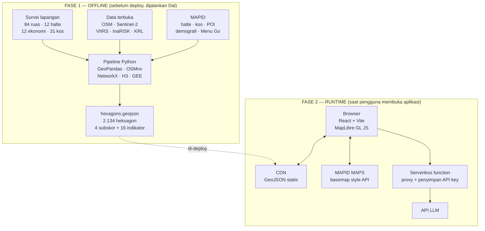
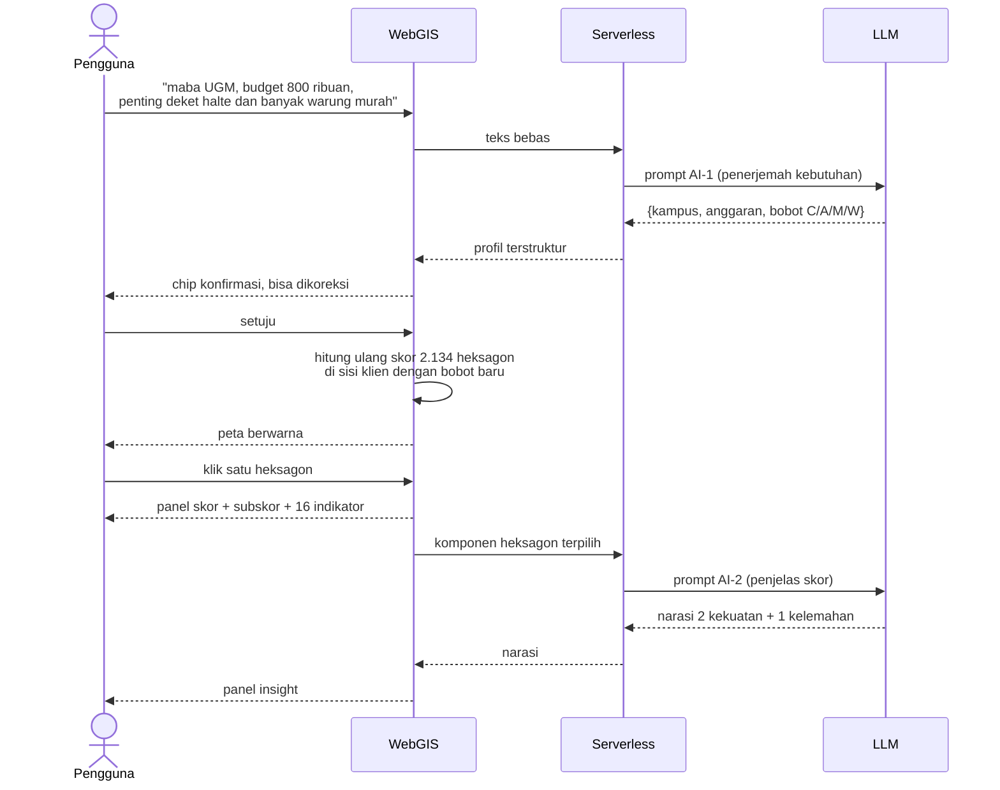

# Arsitektur Grahantara

## Ide dalam satu paragraf

Semua analisis spasial dijalankan **offline**, sekali, sebelum deploy. Hasilnya dibekukan
jadi GeoJSON statis dan disajikan lewat CDN. Tidak ada basis data runtime, tidak ada server
aplikasi. Frontend hanya membaca file, menggambar peta, dan menghitung ulang skor di sisi
klien saat pengguna menggeser bobot. Satu-satunya panggilan server saat runtime adalah ke
API model bahasa, lewat serverless function yang menyembunyikan API key.

Konsekuensinya: aplikasi ini sangat murah, sangat cepat, dan tidak bisa rusak karena
database mati. Harganya adalah skor tidak berubah kecuali pipeline dijalankan ulang.

## Dua fase



Perhatikan garis putus-putus. Itu satu-satunya jembatan antara dua fase, dan bentuknya
adalah file. Bukan API, bukan database. Itulah kenapa Dal dan Devon bisa bekerja paralel
tanpa saling menunggu.

## Aliran data pengguna



**Yang tidak pernah terjadi:** LLM tidak pernah menerima data mentah, dan tidak pernah
diminta menghitung skor. Inputnya selalu hasil analisis yang sudah jadi angka. Narasi wajib
merujuk nama komponen dan hanya boleh memakai angka yang tampil di panel. Ini bukan
pembatasan gaya — ini yang membuat outputnya bisa diverifikasi.

## Empat fungsi AI

| Kode | Fungsi | Input | Output | Status |
|---|---|---|---|---|
| AI-1 | Penerjemah kebutuhan | Kalimat bebas | JSON: kampus, anggaran, 4 bobot | **Wajib** |
| AI-2 | Penjelas skor | Nilai + persentil komponen | Narasi 2 kekuatan, 1 kelemahan | **Wajib** |
| AI-3 | Pembaca spanduk kos | Foto spanduk | Harga + tingkat keyakinan | Opsional |
| AI-4 | Pembanding kawasan | Komponen 2 heksagon + bobot | Tabel + simpulan | Nice to have |

AI-3 sedang ditangguhkan. Harga kos diambil dari survei lapangan.

## Kenapa rata-rata geometrik

Aritmetik memungkinkan kawasan dengan Connectivity 5 dan Amenity 95 terlihat "sedang".
Geometrik tidak. Kalau satu dimensi mendekati nol, skor total ikut mendekati nol, berapa
pun dimensi lainnya. Itu perilaku yang benar untuk keputusan hunian: kos dengan warung
melimpah tapi tanpa akses transit tetap salah pilihan bagi mahasiswa tanpa motor.

`ε = 0,01` mencegah nol absolut membuat seluruh skor jadi nol dan membuat fungsinya tetap
terdefinisi saat sebuah dimensi benar-benar kosong.

## Deployment

| Komponen | Rencana |
|---|---|
| Frontend | Vercel, build statis, CDN global. Push ke `main` memicu build. |
| Backend | Vercel serverless function. Fungsi tunggal: proxy ke API LLM. |
| Database | Tidak ada. GeoJSON statis di CDN. |
| Basemap | MAPID MAPS via style API. Kunci basemap terpisah dari kunci data. |
| Domain | Subdomain MAPID dari panitia, dipetakan ke Vercel. |
| Repo | GitHub, privat selama pengembangan. |

## Sumber data survei lapangan

Foto dan lokasi hasil survei hidup di MAPID Apps, diambil lewat Activities API:

```
POST https://server.mapid.io/web/competition/activities
Header: x-api-key: <API_KEY_MISSION>
Body:   { feature: <Polygon>, start_date, end_date, hashtag: ["cinajawabatak"] }
```

160 Activity, semuanya bertag `#cinajawabatak`. **Selalu kirim rentang tanggal** — tanpa
itu API membatasi hasil di 60 item tanpa pagination dan tanpa peringatan.

Yang dikembalikan hanya `description`, `geometry`, `medias`, `created_at`. Tidak ada field
numerik. Jadi Activities adalah **lapisan bukti** (foto, popup, provenance untuk narasi
AI-2), bukan sumber angka. Angka survei hidup di spreadsheet dan masuk lewat pipeline.
